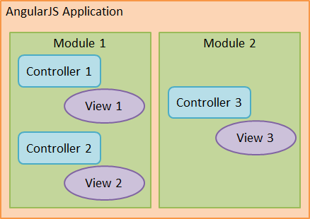

<!--

WARNING!! DON'T EDIT THE FILE README.md on the root of the project, that one is a GENERATED FILE!

You should just edit the source file at src/README.md - the one which stars with ## AngularJS - Superheroic JavaScript MVW Framework

-->

## AngularJS - Superheroic JavaScript MVW Framework


Rafael Guedes @ [Avenue Code](http://www.avenuecode.com)

*rguedes@avenuecode.com*

Mar 11th, 2014

---

## Agenda

 - Overview
 - Controller
 - Service
 - Directive
 - Route
 - Testing
 - Hands-on
 - Challenge

----

## Prerequisites

- Intermediate Javascript
- Design Patterns

---

## Overview

- Created by Google, maintained by community
- MVW architecture
- Lets you extend HTML vocabulary
- JS and HTML codes on where they belong
- Dependency Injection
- 2-way data-binding

----

## 2-way data-binding


Bad | Good
--- | ---
 | 

----

## Don't think jQuery

> AngularJS should be thought in a declarative way of programming

 - No DOM manipulation
 - No jQuery. There's *always* an AngularJS way of write it
 - Data-binding into templates

---

 ## Basics

  - ng-app
   - Designates root element (e.g html, body)
  - ng-model
  - {{ }}

```
<html ng-app>
[...]
<input type="text" ng-model="yourName" placeholder="Enter a name here">
<hr>
<h1>Hello {{ yourName }}!</h1>
<p>{{ 1 + 1 }}</p>
<pre>{{ data.result | json }}</pre>
[...]
</html>
```

----

## Controllers



----

## Controllers

```
<div ng-controller="MagicCtrl">
  <button ng-click="doTheMagic" />
  <span ng-show="magicText"> Including {{ magicText }}</span>
  <ul ng-repeat="text in texts">
    <li>{{ text }}</li>
  </ul>
</div>
```

```
function MagicCtrl($scope) {
  $scope.texts = [
    'Abra',
    'Kadabra'
  ];

  $scope.doTheMagic = function() {
    var text = 'Alakazan';
    $scope.magicText = text;
    $scope.texts.push(text);
  };
};
```

---

## Services

 - Singleton classes/functions
 - Contain business logic
 - Fetch & manipulate data
 - Serve Controllers, Directives, Filters, etc


----

## Services

```
angular.module('myModule').service('MagicService', function() {
  var magicTexts = [
    'Abra',
    'Kadabra',
    'Alakazan'
  ];
  this.getMagicText = function() {
    return magicTexts.pop();
  };
});
```

```
function MagicCtrl($scope, MagicService) {
  $scope.texts = [];

  $scope.doTheMagic = function() {
    var text = MagicService.getMagicText();

    $scope.magicText = text;
    $scope.texts.push(text);
  };
};
```

----

## Services

> AngularJS services are REST-friendly :)
